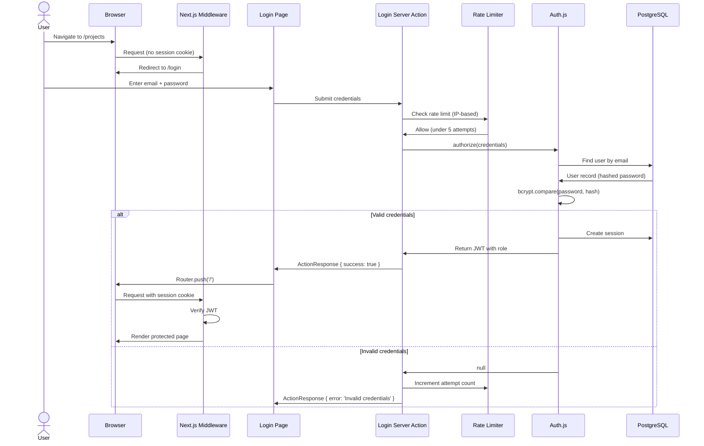

# Authentication Flow

```mermaid
sequenceDiagram
    actor User
    participant Browser
    participant MW as Next.js Middleware
    participant Login as Login Page
    participant SA as Login Server Action
    participant RL as Rate Limiter
    participant Auth as Auth.js
    participant DB as PostgreSQL

    User->>Browser: Navigate to /projects
    Browser->>MW: Request (no session cookie)
    MW->>Browser: Redirect to /login

    User->>Login: Enter email + password
    Login->>SA: Submit credentials
    SA->>RL: Check rate limit (IP-based)
    RL->>SA: Allow (under 5 attempts)

    SA->>Auth: authorize(credentials)
    Auth->>DB: Find user by email
    DB->>Auth: User record (hashed password)
    Auth->>Auth: bcrypt.compare(password, hash)
    Alt Valid credentials
        Auth->>DB: Create session
        Auth->>SA: Return JWT with role
        SA->>Login: ActionResponse { success: true }
        Login->>Browser: Router.push('/')
        Browser->>MW: Request with session cookie
        MW->>MW: Verify JWT
        MW->>Browser: Render protected page
    Else Invalid credentials
        Auth->>SA: null
        SA->>RL: Increment attempt count
        SA->>Login: ActionResponse { error: 'Invalid credentials' }
    End
```
