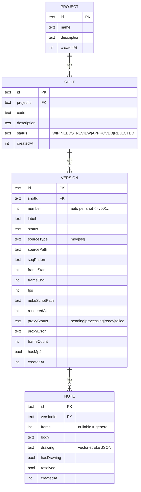

# Data model

Entity relationships. Schema lives in `src/lib/db/schema.ts`; generated SQL in
`drizzle/`.

Cascade deletes flow down: deleting a project removes its shots → versions →
notes. Generated proxy media under `data/media/<versionId>/` is owned by the app
and is not represented in the DB (paths are derived from the version id).
