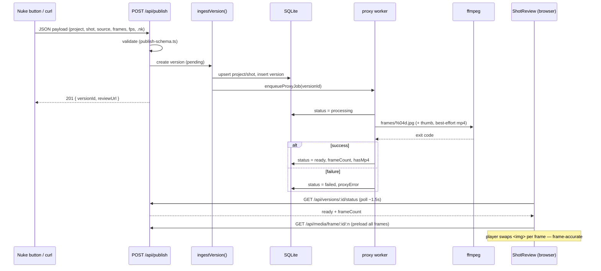

# Publish → proxy → review pipeline

From a Nuke publish (or curl / manual form) to a frame-accurate review.

The worker is a single-job in-process queue (`src/lib/proxy/worker.ts`): one
ffmpeg at a time, in-memory. A version stuck `pending`/`processing` after a
server restart is re-runnable via "Retry" (`reprocessVersionAction`).
