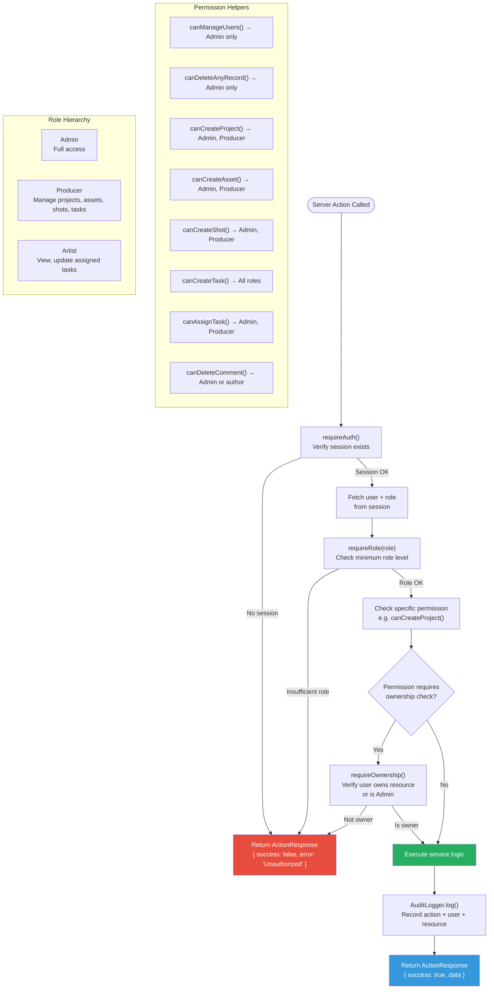

# RBAC Authorization Flow

```mermaid
flowchart TD
    Start(["Server Action Called"]) --> CheckAuth["requireAuth()<br/>Verify session exists"]
    CheckAuth -->|No session| Deny["Return ActionResponse<br/>{ success: false, error: 'Unauthorized' }"]
    CheckAuth -->|Session OK| GetUser["Fetch user + role<br/>from session"]
    GetUser --> CheckRole["requireRole(role)<br/>Check minimum role level"]
    CheckRole -->|Insufficient role| Deny
    
    CheckRole -->|Role OK| GetPerm["Check specific permission<br/>e.g. canCreateProject()"]
    GetPerm --> CheckOwn{"Permission requires<br/>ownership check?"}
    
    CheckOwn -->|Yes| OwnCheck["requireOwnership()<br/>Verify user owns resource<br/>or is Admin"]
    OwnCheck -->|Not owner| Deny
    OwnCheck -->|Is owner| Execute["Execute service logic"]
    
    CheckOwn -->|No| Execute
    
    Execute --> Log["AuditLogger.log()<br/>Record action + user + resource"]
    Log --> Return["Return ActionResponse<br/>{ success: true, data }"]

    subgraph Legend["Permission Helpers"]
        P1["canManageUsers() → Admin only"]
        P2["canDeleteAnyRecord() → Admin only"]
        P3["canCreateProject() → Admin, Producer"]
        P4["canCreateAsset() → Admin, Producer"]
        P5["canCreateShot() → Admin, Producer"]
        P6["canCreateTask() → All roles"]
        P7["canAssignTask() → Admin, Producer"]
        P8["canDeleteComment() → Admin or author"]
    end

    subgraph Roles["Role Hierarchy"]
        R1["Admin<br/>Full access"]
        R2["Producer<br/>Manage projects, assets, shots, tasks"]
        R3["Artist<br/>View, update assigned tasks"]
    end

    style Deny fill:#e74c3c,color:#fff
    style Execute fill:#27ae60,color:#fff
    style Return fill:#3498db,color:#fff
```
