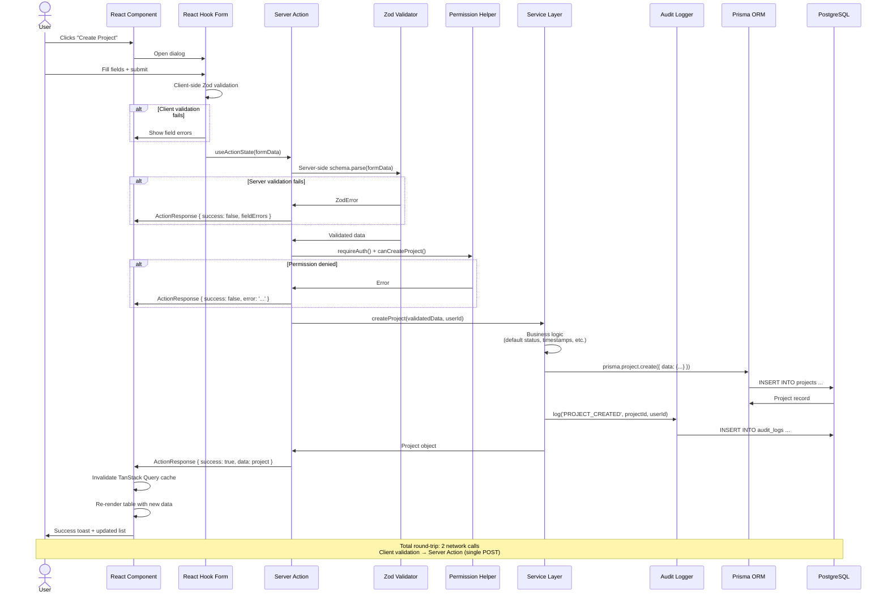

# Request Lifecycle

```mermaid
sequenceDiagram
    actor User
    participant UI as React Component
    participant Form as React Hook Form
    participant Action as Server Action
    participant Zod as Zod Validator
    participant Perm as Permission Helper
    participant Service as Service Layer
    participant Audit as Audit Logger
    participant Prisma as Prisma ORM
    participant DB as PostgreSQL

    User->>UI: Clicks "Create Project"
    UI->>Form: Open dialog
    User->>Form: Fill fields + submit
    
    Form->>Form: Client-side Zod validation
    Alt Client validation fails
        Form->>UI: Show field errors
    End
    
    Form->>Action: useActionState(formData)
    
    Action->>Zod: Server-side schema.parse(formData)
    Alt Server validation fails
        Zod->>Action: ZodError
        Action->>UI: ActionResponse { success: false, fieldErrors }
    End
    
    Zod->>Action: Validated data
    Action->>Perm: requireAuth() + canCreateProject()
    Alt Permission denied
        Perm->>Action: Error
        Action->>UI: ActionResponse { success: false, error: '...' }
    End
    
    Action->>Service: createProject(validatedData, userId)
    
    Service->>Service: Business logic<br/>(default status, timestamps, etc.)
    Service->>Prisma: prisma.project.create({ data: {...} })
    Prisma->>DB: INSERT INTO projects ...
    DB->>Prisma: Project record
    
    Service->>Audit: log('PROJECT_CREATED', projectId, userId)
    Audit->>DB: INSERT INTO audit_logs ...
    
    Service->>Action: Project object
    Action->>UI: ActionResponse { success: true, data: project }
    
    UI->>UI: Invalidate TanStack Query cache
    UI->>UI: Re-render table with new data
    UI->>User: Success toast + updated list

    Note over User,DB: Total round-trip: 2 network calls<br/>Client validation → Server Action (single POST)
```
