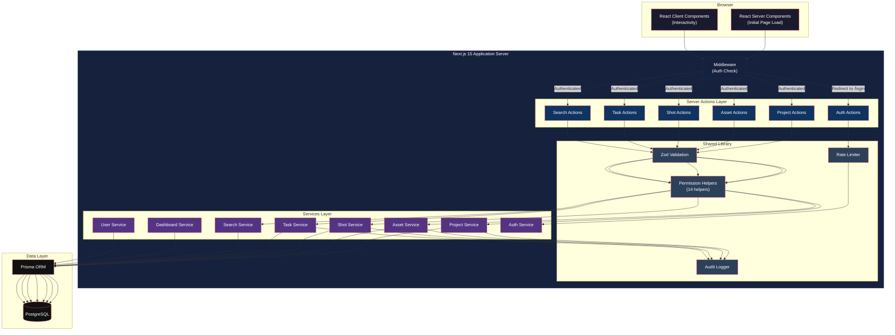

# System Architecture

```mermaid
graph TB
    subgraph Browser["Browser"]
        RSC["React Server Components<br/>(Initial Page Load)"]
        CC["React Client Components<br/>(Interactivity)"]
    end

    subgraph NextJS["Next.js 15 Application Server"]
        direction TB
        MW["Middleware<br/>(Auth Check)"]
        
        subgraph ServerActions["Server Actions Layer"]
            SA1["Project Actions"]
            SA2["Asset Actions"]
            SA3["Shot Actions"]
            SA4["Task Actions"]
            SA5["Search Actions"]
            SA6["Auth Actions"]
        end
        
        subgraph Services["Services Layer"]
            PS["Project Service"]
            AS["Asset Service"]
            SS["Shot Service"]
            TS["Task Service"]
            SRS["Search Service"]
            DS["Dashboard Service"]
            US["User Service"]
            AUS["Auth Service"]
        end
        
        subgraph Library["Shared Library"]
            PR["Permission Helpers<br/>(14 helpers)"]
            AL["Audit Logger"]
            RL["Rate Limiter"]
            ZV["Zod Validation"]
        end
    end

    subgraph Data["Data Layer"]
        PQ["Prisma ORM"]
        PG[("PostgreSQL")]
    end

    RSC --> MW
    CC --> MW
    MW -->|Authenticated| SA1
    MW -->|Authenticated| SA2
    MW -->|Authenticated| SA3
    MW -->|Authenticated| SA4
    MW -->|Authenticated| SA5
    MW -->|Redirect to /login| SA6

    SA1 --> ZV --> PR --> PS --> AL
    SA2 --> ZV --> PR --> AS --> AL
    SA3 --> ZV --> PR --> SS --> AL
    SA4 --> ZV --> PR --> TS --> AL
    SA5 --> ZV --> PR --> SRS
    SA6 --> RL --> AUS

    PS --> PQ --> PG
    AS --> PQ --> PG
    SS --> PQ --> PG
    TS --> PQ --> PG
    SRS --> PQ --> PG
    DS --> PQ --> PG
    US --> PQ --> PG

    classDef browser fill:#1a1a2e,stroke:#e94560,color:#fff
    classDef nextjs fill:#16213e,stroke:#0f3460,color:#fff
    classDef actions fill:#0f3460,stroke:#e94560,color:#fff
    classDef services fill:#533483,stroke:#e94560,color:#fff
    classDef lib fill:#2d4059,stroke:#e94560,color:#fff
    classDef data fill:#111,stroke:#e94560,color:#fff
    
    class RSC,CC browser
    class MW,NextJS nextjs
    class SA1,SA2,SA3,SA4,SA5,SA6 actions
    class PS,AS,SS,TS,SRS,DS,US,AUS services
    class PR,AL,RL,ZV lib
    class PQ,PG data
```
